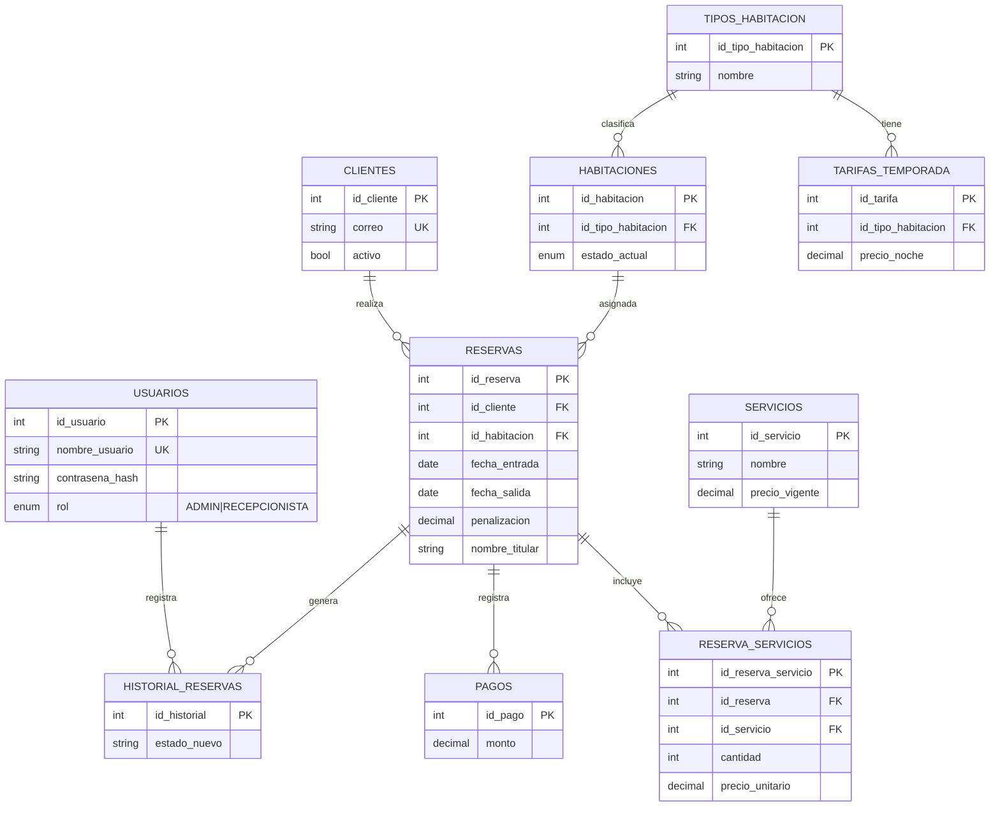
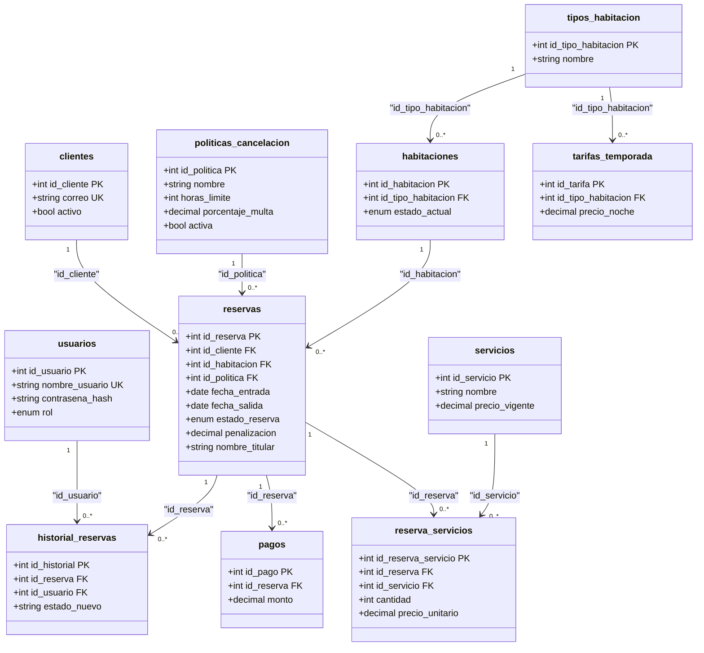

# 1. Descripcion del Proyecto (Analisis de Requerimientos)

El objetivo es diseñar una base de datos relacional robusta para gestionar las reservas de un hotel. El diseño esta estrictamente enfocado en la integridad a nivel del motor de bases de datos, abarcando gestion de clientes, catalogos, tarifas dinamicas, politicas de cancelacion y auditoria.

Se incluye un esquema de roles (Administrador y Recepcionista) para controlar el acceso a las transacciones y garantizar la seguridad de la informacion estructurada.

## Requerimientos Funcionales (RF enfocados a BD)

- **RF1 - Gestion de clientes:** Registro, modificacion y borrado logico de huespedes en la tabla principal.

- **RF2 - Catalogo de tipos de habitacion:** Definicion de categorias y tarifas estacionales mediante restricciones de integridad.

- **RF3 - Inventario de habitaciones:** Control de estado fisico en tiempo real (disponible, ocupada, mantenimiento).

- **RF4 - Creacion de reservas:** Asignacion de fechas garantizando ausencia de solapamientos logicos. Se almacena una instantanea de datos del titular y se vincula la politica de cancelacion activa.

- **RF5 - Cancelacion de reservas:** Liberacion de disponibilidad y aplicacion automatica de multas consultando el catalogo dinamico de politicas.

- **RF6 - Servicios adicionales:** Inclusion de extras mediante una tabla puente que congela el precio al reservar.

- **RF7 - Registro de pagos:** Control de abonos totales o parciales indicando metodo de pago en un historial transaccional.

- **RF8 - Consulta de disponibilidad:** Busqueda logica de habitaciones libres calculada dinamicamente mediante algebra relacional sobre las reservas.

- **RF9 - Facturacion al checkout:** Calculo de saldo pendiente consolidando tablas (noches + servicios - abonos - multas).

- **RF10 - Historial de cambios:** Trigger o bitacora de auditoria para registrar mutaciones de estado de reservas y usuarios responsables.

## Requerimientos No Funcionales Clave (RNF enfocados a BD)

- **RNF1 - Consistencia:** Prevencion transaccional y bloqueos a nivel de base de datos para evitar dobles reservas. Uso de restricciones CHECK para validar fechas (salida > entrada).

- **RNF2 - Seguridad:** Proteccion de datos financieros, guardando solo el metodo de pago sin datos sensibles. Uso exclusivo de hashes criptograficos para contraseñas.

- **RNF3 - Escalabilidad:** Diseño fuertemente normalizado (3NF) para permitir la incorporacion de nuevas reglas de negocio sin refactorizar el esquema.

## Roles y Permisos a nivel de Backend

- **Administrador (ADMIN):** Acceso total. Gestion de usuarios (CRUD), catalogos (habitaciones, politicas, tarifas) y auditoria global de la base de datos.

- **Recepcionista (RECEPCIONISTA):** Gestion operativa. CRUD de clientes, creacion/cancelacion de reservas, pagos y consultas de disponibilidad. Sin permisos de modificacion sobre catalogos o usuarios.

---

# 2. Evolucion del Modelo y Normalizacion

Para garantizar la integridad referencial y eliminar redundancias, el modelo conceptual inicial fue normalizado hasta la Tercera Forma Normal (3NF).

Se introdujo la entidad `politicas_cancelacion` para evitar tener reglas comerciales estaticas en el codigo PHP. Al crear la reserva, la politica se vincula directamente, garantizando la consistencia historica.

### 2.1 Modelo Entidad-Relación Inicial (Antes)

En la fase conceptual, se identifican las entidades principales y las reglas de negocio. En este punto, existen relaciones de muchos a muchos (M:N), como la de `RESERVAS` y `SERVICIOS`.




### 2.2 Modelo Relacional Normalizado (Después)

Este diagrama refleja la estructura 3NF final. Los estados físicos se separan de la lógica transaccional, y las políticas de cancelación gobiernan las penalizaciones de las reservas.



---
## Observaciones

- Todas las tablas tienen una clave primaria simple y autoincrementable.
- Las claves foráneas garantizan la integridad referencial con eliminación en cascada (ON DELETE CASCADE).
- No existen dependencias transitivas: los atributos no clave dependen directamente de la clave primaria de su tabla.
- Los campos como `nombre_titular`, etc., en reservas son copias históricas, no dependen de clientes para preservar la información.
## 3. Diccionario de Datos (Modelo Normalizado 3NF)

A continuacion, se define la estructura tecnica de cada entidad asegurando dependencias exclusivas hacia la clave primaria.

### Tablas de Catalogo y Maestras

| Tabla | Columna | Tipo | Nulabilidad | Descripcion |
| :--- | :--- | :--- | :--- | :--- |
| **usuarios** | id_usuario | INT | NO NULO | PK, autoincrementable |
| | nombre_usuario | VARCHAR(50) | NO NULO | UNICO |
| | contrasena_hash | VARCHAR(255) | NO NULO | Hash encriptado (bcrypt/Argon2) |
| | rol | ENUM | NO NULO | 'ADMIN' o 'RECEPCIONISTA' |
| **clientes** | id_cliente | INT | NO NULO | PK, autoincrementable |
| | correo | VARCHAR(100) | NULO | UNICO |
| | activo | BOOLEAN | NO NULO | Borrado logico. DEFAULT TRUE |
| **politicas_cancelacion** | id_politica | INT | NO NULO | PK, autoincrementable |
| | nombre | VARCHAR(50) | NO NULO | Ej: "Estricta 48 hrs" |
| | horas_limite | INT | NO NULO | Tiempo limite previo al Check-In |
| | porcentaje_multa | DECIMAL(5,2) | NO NULO | Multa aplicable (0.00 a 100.00) |
| **tipos_habitacion** | id_tipo_habitacion | INT | NO NULO | PK, autoincrementable |
| | nombre | VARCHAR(50) | NO NULO | Categoria (Simple, Doble, Suite) |

### Tablas Operativas y de Inventario

| Tabla | Columna | Tipo | Nulabilidad | Descripcion |
| :--- | :--- | :--- | :--- | :--- |
| **tarifas_temporada** | id_tarifa | INT | NO NULO | PK, autoincrementable |
| | id_tipo_habitacion | INT | NO NULO | FK a tipos_habitacion |
| | precio_noche | DECIMAL(10,2) | NO NULO | Costo base |
| | fecha_inicio | DATE | NO NULO | Vigencia inicio |
| | fecha_fin | DATE | NO NULO | Vigencia fin |
| **habitaciones** | id_habitacion | INT | NO NULO | PK (Numero fisico del cuarto) |
| | id_tipo_habitacion | INT | NO NULO | FK a tipos_habitacion |
| | estado_actual | ENUM | NO NULO | 'DISPONIBLE','OCUPADA','MANTENIMIENTO' |
| **servicios** | id_servicio | INT | NO NULO | PK, autoincrementable |
| | precio_vigente | DECIMAL(10,2) | NO NULO | Costo actual para nuevos cargos |

### Entidades Transaccionales (Reservas)

| Tabla | Columna | Tipo | Nulabilidad | Descripcion |
| :--- | :--- | :--- | :--- | :--- |
| **reservas** | id_reserva | INT | NO NULO | PK, autoincrementable |
| | id_cliente | INT | NO NULO | FK a clientes |
| | id_habitacion | INT | NO NULO | FK a habitaciones |
| | id_politica | INT | NO NULO | FK (Politica comercial congelada) |
| | fecha_entrada | DATE | NO NULO | Inicio de hospedaje |
| | fecha_salida | DATE | NO NULO | Fin de hospedaje |
| | estado_reserva | ENUM | NO NULO | 'ACTIVA','CONFIRMADA','CANCELADA','COMPLETADA' |
| | penalizacion | DECIMAL(10,2) | NULO | Multa procesada en cancelacion |
| | nombre_titular | VARCHAR(50) | NO NULO | Copia historica inmutable |
| **reserva_servicios** | id_reserva_servicio | INT | NO NULO | PK, autoincrementable |
| | id_reserva | INT | NO NULO | FK a reservas |
| | id_servicio | INT | NO NULO | FK a servicios |
| | precio_unitario | DECIMAL(10,2) | NO NULO | Costo congelado al momento del cargo |
| **pagos** | id_pago | INT | NO NULO | PK, autoincrementable |
| | monto | DECIMAL(10,2) | NO NULO | Dinero abonado a la cuenta |
| | metodo_pago | ENUM | NO NULO | 'EFECTIVO','TARJETA','TRANSFERENCIA' |
| **historial_reservas** | id_historial | INT | NO NULO | PK, autoincrementable (Auditoria) |
| | estado_anterior | VARCHAR(20) | NO NULO | Estado previo |
| | estado_nuevo | VARCHAR(20) | NO NULO | Estado actual tras el evento |
| | id_usuario | INT | NO NULO | FK a usuarios (Quien lo modifico) |

## 4. Script de Base de Datos (SQL DDL)

El siguiente script crea la base de datos y todas las tablas respetando el orden de dependencias para garantizar la integridad referencial de las claves foráneas.


```sql
-- Crear base de datos
CREATE DATABASE IF NOT EXISTS hotel_reservas_db CHARACTER SET utf8mb4 COLLATE utf8mb4_unicode_ci;
USE hotel_reservas_db;

-- 1. Tablas Catálogo e Independientes
CREATE TABLE politicas_cancelacion (
id_politica INT AUTO_INCREMENT PRIMARY KEY,
nombre VARCHAR(50) NOT NULL,
horas_limite INT NOT NULL CHECK (horas_limite >= 0),
porcentaje_multa DECIMAL(5,2) NOT NULL CHECK (porcentaje_multa BETWEEN 0.00 AND 100.00),
activa BOOLEAN NOT NULL DEFAULT TRUE
) ENGINE=InnoDB;

CREATE TABLE tipos_habitacion (
id_tipo_habitacion INT AUTO_INCREMENT PRIMARY KEY,
nombre VARCHAR(50) NOT NULL,
capacidad INT NOT NULL CHECK (capacidad > 0),
descripcion TEXT
) ENGINE=InnoDB;

CREATE TABLE servicios (
id_servicio INT AUTO_INCREMENT PRIMARY KEY,
nombre VARCHAR(100) NOT NULL,
precio_vigente DECIMAL(10,2) NOT NULL CHECK (precio_vigente >= 0),
descripcion TEXT
) ENGINE=InnoDB;

CREATE TABLE clientes (
id_cliente INT AUTO_INCREMENT PRIMARY KEY,
nombre VARCHAR(50) NOT NULL,
apellido_paterno VARCHAR(50) NOT NULL,
apellido_materno VARCHAR(50),
telefono VARCHAR(20),
correo VARCHAR(100) UNIQUE,
activo BOOLEAN NOT NULL DEFAULT TRUE
) ENGINE=InnoDB;

CREATE TABLE usuarios (
id_usuario INT AUTO_INCREMENT PRIMARY KEY,
nombre_usuario VARCHAR(50) NOT NULL UNIQUE,
nombre VARCHAR(50) NOT NULL,
apellido_paterno VARCHAR(50) NOT NULL,
apellido_materno VARCHAR(50),
contrasena_hash VARCHAR(255) NOT NULL,
rol ENUM('ADMIN', 'RECEPCIONISTA') NOT NULL
) ENGINE=InnoDB;

-- 2. Tablas con Dependencias Nivel 1
CREATE TABLE tarifas_temporada (
id_tarifa INT AUTO_INCREMENT PRIMARY KEY,
id_tipo_habitacion INT NOT NULL,
temporada ENUM('ALTA', 'BAJA') NOT NULL,
precio_noche DECIMAL(10,2) NOT NULL CHECK (precio_noche >= 0),
fecha_inicio DATE NOT NULL,
fecha_fin DATE NOT NULL,
FOREIGN KEY (id_tipo_habitacion) REFERENCES tipos_habitacion(id_tipo_habitacion) ON DELETE CASCADE,
CHECK (fecha_fin >= fecha_inicio)
) ENGINE=InnoDB;

CREATE TABLE habitaciones (
id_habitacion INT PRIMARY KEY,
id_tipo_habitacion INT NOT NULL,
piso INT NOT NULL,
estado_actual ENUM('DISPONIBLE', 'OCUPADA', 'MANTENIMIENTO') NOT NULL DEFAULT 'DISPONIBLE',
activa BOOLEAN NOT NULL DEFAULT TRUE,
FOREIGN KEY (id_tipo_habitacion) REFERENCES tipos_habitacion(id_tipo_habitacion) ON DELETE CASCADE
) ENGINE=InnoDB;

-- 3. Tabla Central: RESERVAS
CREATE TABLE reservas (
id_reserva INT AUTO_INCREMENT PRIMARY KEY,
id_cliente INT NOT NULL,
id_habitacion INT NOT NULL,
id_politica INT NOT NULL,
fecha_entrada DATE NOT NULL,
fecha_salida DATE NOT NULL,
estado_reserva ENUM('ACTIVA', 'CONFIRMADA', 'CANCELADA', 'COMPLETADA') NOT NULL DEFAULT 'ACTIVA',
fecha_creacion DATETIME NOT NULL DEFAULT CURRENT_TIMESTAMP,
penalizacion DECIMAL(10,2) DEFAULT 0.00,
fecha_cancelacion DATETIME,
-- Datos del titular (instantánea histórica)
nombre_titular VARCHAR(50) NOT NULL,
apellido_paterno_titular VARCHAR(50) NOT NULL,
apellido_materno_titular VARCHAR(50),
telefono_titular VARCHAR(20),
correo_titular VARCHAR(100),
FOREIGN KEY (id_cliente) REFERENCES clientes(id_cliente) ON DELETE CASCADE,
FOREIGN KEY (id_habitacion) REFERENCES habitaciones(id_habitacion) ON DELETE CASCADE,
FOREIGN KEY (id_politica) REFERENCES politicas_cancelacion(id_politica),
CHECK (fecha_salida > fecha_entrada)
) ENGINE=InnoDB;

CREATE INDEX idx_reservas_fechas ON reservas(fecha_entrada, fecha_salida);

-- 4. Tablas Operativas
CREATE TABLE reserva_servicios (
id_reserva_servicio INT AUTO_INCREMENT PRIMARY KEY,
id_reserva INT NOT NULL,
id_servicio INT NOT NULL,
cantidad INT NOT NULL CHECK (cantidad > 0),
precio_unitario DECIMAL(10,2) NOT NULL,
FOREIGN KEY (id_reserva) REFERENCES reservas(id_reserva) ON DELETE CASCADE,
FOREIGN KEY (id_servicio) REFERENCES servicios(id_servicio) ON DELETE CASCADE
) ENGINE=InnoDB;

CREATE TABLE pagos (
id_pago INT AUTO_INCREMENT PRIMARY KEY,
id_reserva INT NOT NULL,
monto DECIMAL(10,2) NOT NULL CHECK (monto > 0),
fecha_pago DATETIME NOT NULL DEFAULT CURRENT_TIMESTAMP,
metodo_pago ENUM('EFECTIVO', 'TARJETA', 'TRANSFERENCIA') NOT NULL,
FOREIGN KEY (id_reserva) REFERENCES reservas(id_reserva) ON DELETE CASCADE
) ENGINE=InnoDB;

CREATE TABLE historial_reservas (
id_historial INT AUTO_INCREMENT PRIMARY KEY,
id_reserva INT NOT NULL,
id_usuario INT NOT NULL,
estado_anterior VARCHAR(20) NOT NULL,
estado_nuevo VARCHAR(20) NOT NULL,
fecha_cambio DATETIME NOT NULL DEFAULT CURRENT_TIMESTAMP,
comentario TEXT,
FOREIGN KEY (id_reserva) REFERENCES reservas(id_reserva) ON DELETE CASCADE,
FOREIGN KEY (id_usuario) REFERENCES usuarios(id_usuario) ON DELETE CASCADE
) ENGINE=InnoDB;

-- 5. Datos de Prueba
INSERT INTO politicas_cancelacion (nombre, horas_limite, porcentaje_multa) VALUES
('Flexible 24h', 24, 0.00), ('Estricta 48h', 48, 50.00);

INSERT INTO tipos_habitacion (nombre, capacidad) VALUES
('Simple', 1), ('Doble', 2), ('Suite', 4);

INSERT INTO usuarios (nombre_usuario, nombre, apellido_paterno, contrasena_hash, rol) VALUES
('admin', 'Admin', 'Principal', '$2y$10$e0MYzXjYx7ZQZJ2QZJ2QZuZQZJ2QZJ2QZJ2QZJ2QZJ2QZJ2QZJ2QZJ2', 'ADMIN');


```
Datos de prueba:
```sql
-- ==========================================
-- 5. Datos de Prueba 
-- ==========================================

INSERT INTO tipos_habitacion (nombre, capacidad, descripcion) VALUES
('Simple', 1, 'Habitación individual con cama sencilla'),
('Doble', 2, 'Habitación con cama matrimonial o dos camas individuales'),
('Suite', 4, 'Suite con sala y recámara separada');

INSERT INTO servicios (nombre, precio_vigente, descripcion) VALUES
('Desayuno buffet', 150.00, 'Desayuno completo tipo buffet'),
('Spa', 500.00, 'Acceso al spa y masaje de 30 min'),
('Estacionamiento', 100.00, 'Estacionamiento cubierto por noche');

-- Usuarios de prueba (las contraseñas se gestionan con password_hash() en la aplicación)
-- Los hash mostrados son ilustrativos; se deben generar con password_hash('admin123', PASSWORD_BCRYPT)
INSERT INTO usuarios (nombre_usuario, nombre, apellido_paterno, apellido_materno, contrasena_hash, rol) VALUES
('admin', 'Admin', 'Principal', NULL, '$2y$10$e0MYzXjYx7ZQZJ2QZJ2QZuZQZJ2QZJ2QZJ2QZJ2QZJ2QZJ2QZJ2QZJ2', 'ADMIN'),
('recepcionista1', 'Ana', 'Pérez', 'Gómez', '$2y$10$f0FyYkYlYkYlYkYlYkYlYkYlYkYlYkYlYkYlYkYlYkYlYkYlYkYlY', 'RECEPCIONISTA');
```

## 5. Estructura de Carpetas del Proyecto
```text
proyecto-hotel/
├── backend/
│   ├── config/
│   │   └── database.php              # Configuración PDO/MySQL
│   ├── models/
│   │   ├── Cliente.php
│   │   ├── Reserva.php
│   │   ├── PoliticaCancelacion.php   # Control de políticas
│   │   └── (Otros modelos 1:1 con las tablas)
│   ├── controllers/
│   │   ├── AuthController.php        # Gestión de login/hashes
│   │   ├── ReservaController.php     # Lógica central del sistema
│   │   └── (Otros controladores para CRUD y catálogos)
│   ├── routes/
│   │   └── api.php                   # Endpoints RESTful
│   └── middleware/
│       └── RoleMiddleware.php        # Filtro de seguridad (RBAC)
├── frontend/
│   ├── public/
│   │   ├── css/
│   │   │   └── style.css             # Estilos inmutables puros
│   │   ├── js/
│   │   │   └── app.js                # Lógica JS para validación cliente
│   ├── views/
│   │   ├── catalogos/                # Vistas para habitaciones, tarifas y políticas
│   │   ├── reservas/                 # Módulo de creación y facturación
│   │   ├── usuarios/                 # Solo para ADMIN
│   │   └── historial/                # Auditoría global
├── database/
│   └── schema.sql                    # Script DDL consolidado
└── README.md
``` 
## 6. Logica de Negocio y Flujos de Trabajo (Funcionalidad Detallada)

### 6.1. Autenticacion y Control de Clientes (RF1)

- El backend procesa los logins contrastando la contraseña ingresada con el hash de la base de datos usando `password_verify()`. Una vez iniciada la sesion, se valida el rol para cada peticion.
- El registro de clientes valida correos unicos mediante restricciones SQL. El borrado es exclusivamente logico (desactivacion del flag `activo`), protegiendo la integridad referencial de los historicos de ocupacion.

### 6.2. Catalogos y Tarifas Dinamicas (RF2)

- Las tarifas por noche se establecen relacionando tipos de habitacion con temporadas estacionales. La base de datos impide ingresar rangos de fechas ilogicos mediante sentencias `CHECK`.
- Al calcular una reserva nueva, se extrae el precio correspondiente a la fecha de ingreso, congelandose virtualmente para simplificar la facturacion de estancias combinadas.

### 6.3. Inventario: Estado Fisico vs Disponibilidad Logica (RF3 y RF8)

- El sistema opera con dos planos distintos. El campo `estado_actual` en la tabla `habitaciones` refleja unicamente la realidad fisica y cambia a `OCUPADA` solo durante el Check-In fisico.
- La disponibilidad logica futura (reservar para meses proximos) no altera la tabla de habitaciones. El sistema calcula esta disponibilidad dinamicamente mediante cruces temporales en la tabla `reservas`.

### 6.4. Creacion de Reservas y Congelamiento de Datos (RF4 y RF6)

- Al reservar, el sistema verifica la disponibilidad logica mediante transacciones SQL aisladas. Se asigna la politica de cancelacion vigente y se copian los datos del titular para crear una instantanea historica.
- Si se incluyen servicios extra, la tabla `reserva_servicios` almacena el `precio_vigente` del catalogo, blindando la cuenta del cliente ante incrementos posteriores en los precios del hotel.

### 6.5. Cancelacion Automatizada de Reservas (RF5)

- Al solicitarse una anulacion, el controlador PHP lee el `id_politica` vinculado a la reserva. Luego, compara las horas restantes hasta el Check-In contra las `horas_limite` de la politica.
- Si procede la penalizacion, el sistema calcula el cargo automaticamente aplicando el `porcentaje_multa` sobre el costo de las noches, guardando el valor en la columna `penalizacion`.

### 6.6. Facturacion, Pagos y Auditoria (RF7, RF9 y RF10)

- El total a pagar en el Check-Out se procesa integrando el costo de hospedaje, los consumos extra, los abonos registrados y las posibles penalizaciones en una sola consulta.
- Cada cambio de estado (crear, confirmar, cancelar, liquidar) dispara un registro en la tabla `historial_reservas`, documentando la estampa temporal, los estados alterados y el usuario responsable.

---

## 7. Control de Acceso por Rol (Permisos)

| Modulo / Funcionalidad | Administrador (ADMIN) | Recepcionista (RECEPCIONISTA) |
|------------------------|----------------------|-------------------------------|
| Clientes y Reservas | Acceso Total (CRUD) | Crear, Editar, Cancelar (Propias) |
| Inventario Fisico | Configuracion de Mantenimiento | Operacion (Check-In / Out) |
| Catalogos y Politicas | Crear, Editar y Eliminar | Solo Lectura |
| Servicios y Pagos | Gestion Total de Cargos | Asignacion en Reservas Activas |
| Historial y Usuarios | Acceso y Auditoria Global | Lectura de Historial Propio |

## Estrategia de Validacion y Estilos (Separacion de Capas)

Para garantizar un codigo limpio, mantenible y alineado con las buenas practicas de desarrollo web, se establece una separacion tajante entre la logica de presentacion (frontend) y la logica de negocio (backend).

### Validaciones con JavaScript (Frontend)

- Todas las validaciones de campos en el lado del cliente se realizaran **EXCLUSIVAMENTE** mediante JavaScript, alojado en el archivo `frontend/public/js/app.js`.
- Esto incluye: verificacion de campos obligatorios, formato de correo electronico, longitud de numeros telefonicos, fechas logicas (que la fecha de salida sea posterior a la de entrada), montos positivos y formatos de numeros decimales.
- El objetivo es proporcionar retroalimentacion inmediata al usuario y reducir el envio de peticiones innecesarias al servidor, mejorando la experiencia de usuario.

### Estilos y Diseno con CSS (Frontend)

- Todo el diseno visual, layout, colores, tipografias, efectos de hover, sombras y responsividad se definiran **EXCLUSIVAMENTE** mediante hojas de estilo CSS, alojadas en el archivo `frontend/public/css/style.css`.
- Las reglas se aplicaran mediante clases e identificadores en el HTML. No se permitira el uso de estilos en linea (`style="..."`) ni etiquetas `<style>` dentro de las vistas PHP para mantener la consistencia y facilitar el mantenimiento.

### Logica de Negocio con PHP (Backend)

- Los archivos PHP (controladores y modelos en `backend/`) **NO** contendran codigo HTML, CSS ni JavaScript. Su funcion se limitara a:
    - Recibir peticiones del frontend.
    - Realizar validaciones de seguridad y reglas de negocio en el servidor (ej. verificar que el usuario tenga permisos, evitar inyecciones SQL, comprobar integridad de datos antes de guardar, y verificar la contraseña mediante `password_verify()`).
    - Interactuar con la base de datos.
    - Devolver respuestas en formato JSON o redirigir a las vistas correspondientes.
- Esta arquitectura MVC (Modelo-Vista-Controlador) asegura que los programadores de frontend y backend puedan trabajar en paralelo sin conflictos.

---


## 8. Consultas Útiles para Validación y Reportes(tomar como ejemplo.)
Cálculo de disponibilidad proyectada (Estado Lógico):
```sql
SELECT h.id_habitacion
FROM habitaciones h
WHERE h.activa = TRUE
  AND NOT EXISTS (
    SELECT 1 FROM reservas r
    WHERE r.id_habitacion = h.id_habitacion
      AND r.estado_reserva IN ('ACTIVA', 'CONFIRMADA')
      AND (r.fecha_entrada < ? AND r.fecha_salida > ?)
);
```
Cálculo financiero para facturación final al Check-Out
```sql
SELECT
    r.id_reserva,
    (DATEDIFF(r.fecha_salida, r.fecha_entrada) * t.precio_noche) AS costo_noches,
    COALESCE(SUM(rs.cantidad * rs.precio_unitario), 0) AS total_servicios,
    COALESCE(SUM(p.monto), 0) AS total_pagado,
    r.penalizacion AS multas,
    ((DATEDIFF(r.fecha_salida, r.fecha_entrada) * t.precio_noche)
         + COALESCE(SUM(rs.cantidad * rs.precio_unitario), 0)
         - COALESCE(SUM(p.monto), 0)
        + r.penalizacion) AS saldo_pendiente
FROM reservas r
         JOIN habitaciones h ON r.id_habitacion = h.id_habitacion
         JOIN tarifas_temporada t ON h.id_tipo_habitacion = t.id_tipo_habitacion
         LEFT JOIN reserva_servicios rs ON r.id_reserva = rs.id_reserva
         LEFT JOIN pagos p ON r.id_reserva = p.id_reserva
WHERE r.id_reserva = ?
GROUP BY r.id_reserva, t.precio_noche, r.penalizacion;
```
