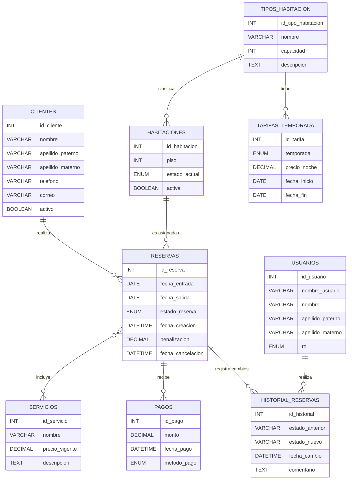
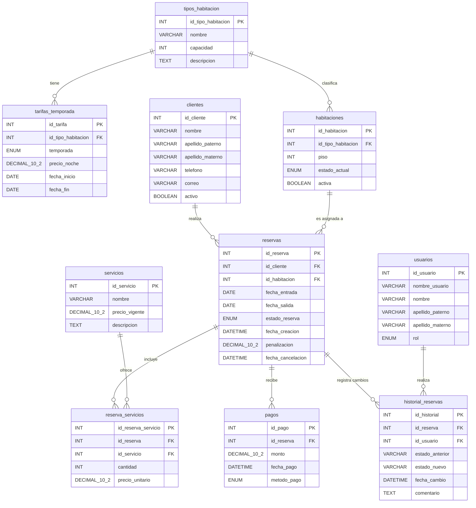

# Modelo ER, Relacional y Normalización - Proyecto (Sistema de Gestión de Citas para Hotel)

**Autores:** Angel Uriel Monterrosas Gonzalez - Noe Tlachi Zenteno  
**Matrícula:** 202339872 - 202162606  
**Institución:** Benemérita Universidad Autónoma de Puebla (BUAP)  
**Carrera:** Licenciatura en Ingeniería en Ciencias de la Computación  
**Materia:** Base de Datos para Ingeniería  
**Profesora:** Beltran Martínez Beatriz  
**Fecha:** 16 de junio de 2026

---

## 1. Descripción del Proyecto (Análisis de Requerimientos)

El objetivo de este proyecto es diseñar una base de datos relacional robusta para gestionar las reservas de un hotel. El sistema abarca la gestión de clientes, catálogo de habitaciones con tarifas dinámicas por temporada, control de inventario, registro de servicios adicionales, pagos y un historial de auditoría.

### Requerimientos Funcionales (RF)
* **RF1 - Gestión de clientes:** Registro, modificación y borrado lógico de huéspedes.
* **RF2 - Catálogo de tipos de habitación:** Definición de categorías (simple, doble, suite) y tarifas estacionales (alta/baja).
* **RF3 - Inventario de habitaciones:** Control de estado (disponible, ocupada, en mantenimiento) por cada unidad física.
* **RF4 - Creación de reservas:** Asignación de fechas sin solapamientos, vinculando clientes y habitaciones.
* **RF5 - Cancelación de reservas:** Liberación de habitaciones y aplicación de políticas de cancelación.
* **RF6 - Servicios adicionales:** Inclusión de extras (desayuno, spa) con congelamiento de precios al momento de la reserva.
* **RF7 - Registro de pagos:** Control de abonos totales o parciales indicando método de pago.
* **RF8 - Consulta de disponibilidad:** Búsqueda ágil de habitaciones libres por rango de fechas.
* **RF9 - Facturación al checkout:** Cálculo automático de saldo pendiente (noches + servicios - abonos).
* **RF10 - Historial de cambios:** Auditoría para registrar qué usuario modificó el estado de una reserva y cuándo.

### Requerimientos No Funcionales Clave (RNF)
* **RNF3 - Consistencia:** Prevención a nivel de base de datos de dobles reservas y fechas ilógicas (salida antes de entrada).
* **RNF5 - Seguridad:** Protección de datos financieros, guardando solo el método de pago sin datos sensibles de tarjetas.
* **RNF6 - Escalabilidad:** Diseño normalizado que permite incorporar nuevas sucursales, habitaciones o servicios sin alterar el esquema base.

---

## 2. Evolución del Modelo y Normalización

Para garantizar la integridad referencial, evitar anomalías de actualización y eliminar redundancias, el modelo conceptual inicial fue sometido a un proceso de normalización hasta alcanzar la **Tercera Forma Normal (3NF)**.

### 2.1 Modelo Entidad-Relación Inicial (Antes)

En la fase conceptual, se identifican las entidades principales y las reglas de negocio. En este punto, existen relaciones de muchos a muchos (M:N), como la de `RESERVAS` y `SERVICIOS`.



### 2.2 Justificación de la Normalización (3NF)

Para transformar el modelo conceptual en un esquema relacional funcional, se aplicaron las siguientes reglas teóricas:

* **Primera Forma Normal (1NF) - Atomicidad:** Se asegura que no haya atributos multivaluados. En lugar de guardar una lista de servicios dentro de la tabla `reservas`, se requiere una estructura independiente.
* **Segunda Forma Normal (2NF) - Eliminación de Dependencias Parciales:** La relación muchos a muchos entre `RESERVAS` y `SERVICIOS` generaba anomalías. Se resolvió creando la entidad asociativa `reserva_servicios` con una clave primaria subrogada (`id_reserva_servicio`). Además, esta tabla captura atributos históricos como el `precio_unitario`, asegurando que si el precio de un servicio cambia en el catálogo, el historial de cobro de reservas pasadas no se altere.
* **Tercera Forma Normal (3NF) - Eliminación de Dependencias Transitivas:** Los precios de las habitaciones no se almacenan directamente en la tabla `habitaciones`. El precio depende funcionalmente del tipo de habitación y de la temporada. Por ello, se segmentaron en las entidades `tipos_habitacion` y `tarifas_temporada`. De esta manera, si el precio de las "Suites" cambia, se actualiza en un solo lugar, eliminando la redundancia.

### 2.3 Modelo Relacional Normalizado (Después)

Este es el diseño físico final, estructurado en 3NF, listo para su implementación en el gestor de base de datos.



---

## 3. Diccionario de Datos (Modelo Normalizado 3NF)

A continuación, se define la estructura técnica de cada entidad en su estado final.

### Tabla: `usuarios`
**Descripción:** Personal que gestiona las reservas. Requerido para la auditoría (RF10).

| Columna | Tipo de dato | Longitud | ¿Nulo? | Clave | Descripción |
|---------|--------------|----------|--------|-------|-------------|
| `id_usuario` | `INT` | - | No | **PK** | Identificador del usuario (Auto_increment). |
| `nombre_usuario` | `VARCHAR` | 50 | No | - | Nombre de usuario para login. |
| `nombre` | `VARCHAR` | 50 | No | - | Nombre(s) del empleado. |
| `apellido_paterno`| `VARCHAR` | 50 | No | - | Apellido paterno. |
| `apellido_materno`| `VARCHAR` | 50 | Sí | - | Apellido materno. |
| `rol` | `ENUM` | - | No | - | ('ADMIN','RECEPCIONISTA') |

### Tabla: `clientes`
**Descripción:** Almacena los datos de los huéspedes. Soporta borrado lógico (RF1).

| Columna | Tipo de dato | Longitud | ¿Nulo? | Clave | Descripción |
|---------|--------------|----------|--------|-------|-------------|
| `id_cliente` | `INT` | - | No | **PK** | ID único del cliente (Auto_increment). |
| `nombre` | `VARCHAR` | 50 | No | - | Nombre(s). |
| `apellido_paterno`| `VARCHAR` | 50 | No | - | Apellido paterno. |
| `apellido_materno`| `VARCHAR` | 50 | Sí | - | Apellido materno. |
| `telefono` | `VARCHAR` | 20 | Sí | - | Número de contacto. |
| `correo` | `VARCHAR` | 100 | Sí | - | Correo electrónico (`UNIQUE`). |
| `activo` | `BOOLEAN` | - | No | - | Indica si está activo (Default: TRUE). |

### Tabla: `tipos_habitacion`
**Descripción:** Catálogo de categorías de habitaciones (RF2).

| Columna | Tipo de dato | Longitud | ¿Nulo? | Clave | Descripción |
|---------|--------------|----------|--------|-------|-------------|
| `id_tipo_habitacion`| `INT` | - | No | **PK** | ID de categoría (Auto_increment). |
| `nombre` | `VARCHAR` | 50 | No | - | Ej. "Simple", "Doble", "Suite". |
| `capacidad` | `INT` | - | No | - | Número máximo de personas. |
| `descripcion` | `TEXT` | - | Sí | - | Amenidades y detalles. |

### Tabla: `tarifas_temporada`
**Descripción:** Define precios por tipo de habitación según temporada (RF2).

| Columna | Tipo de dato | Precisión | ¿Nulo? | Clave | Descripción |
|---------|--------------|-----------|--------|-------|-------------|
| `id_tarifa` | `INT` | - | No | **PK** | ID de tarifa (Auto_increment). |
| `id_tipo_habitacion`| `INT` | - | No | **FK** | Ref. al tipo de habitación. |
| `temporada` | `ENUM` | - | No | - | ('ALTA','BAJA'). |
| `precio_noche` | `DECIMAL` | 10,2 | No | - | Precio por noche. |
| `fecha_inicio` | `DATE` | - | No | - | Inicio de vigencia de la tarifa. |
| `fecha_fin` | `DATE` | - | No | - | Fin de vigencia de la tarifa. |

### Tabla: `habitaciones`
**Descripción:** Registro físico de cada habitación y su estado operativo (RF3).

| Columna | Tipo de dato | Longitud | ¿Nulo? | Clave | Descripción |
|---------|--------------|----------|--------|-------|-------------|
| `id_habitacion` | `INT` | - | No | **PK** | Número de la habitación (Ej. 101). |
| `id_tipo_habitacion`| `INT` | - | No | **FK** | Categoría asignada. |
| `piso` | `INT` | - | No | - | Nivel del hotel. |
| `estado_actual` | `ENUM` | - | No | - | ('DISPONIBLE','OCUPADA','MANTENIMIENTO'). |
| `activa` | `BOOLEAN` | - | No | - | Operatividad física (Default: TRUE). |

### Tabla: `reservas`
**Descripción:** Entidad central que vincula clientes con habitaciones en fechas específicas (RF4, RF5).

| Columna | Tipo de dato | Precisión | ¿Nulo? | Clave | Descripción |
|---------|--------------|-----------|--------|-------|-------------|
| `id_reserva` | `INT` | - | No | **PK** | ID de reserva (Auto_increment). |
| `id_cliente` | `INT` | - | No | **FK** | Cliente titular. |
| `id_habitacion` | `INT` | - | No | **FK** | Habitación asignada. |
| `fecha_entrada` | `DATE` | - | No | - | Check-in. |
| `fecha_salida` | `DATE` | - | No | - | Check-out. |
| `estado_reserva` | `ENUM` | - | No | - | ('ACTIVA','CONFIRMADA','CANCELADA','COMPLETADA'). |
| `fecha_creacion` | `DATETIME` | - | No | - | Timestamp de creación. |
| `penalizacion` | `DECIMAL` | 10,2 | Sí | - | Cobro por cancelación tardía. |
| `fecha_cancelacion` | `DATETIME` | - | Sí | - | Fecha de anulación si aplica. |

### Tabla: `servicios`
**Descripción:** Catálogo general de servicios extras ofrecidos (RF6).

| Columna | Tipo de dato | Precisión | ¿Nulo? | Clave | Descripción |
|---------|--------------|-----------|--------|-------|-------------|
| `id_servicio` | `INT` | - | No | **PK** | ID del servicio. |
| `nombre` | `VARCHAR` | 100 | No | - | Ej. Desayuno buffet, Spa. |
| `precio_vigente` | `DECIMAL` | 10,2 | No | - | Costo actual en catálogo. |
| `descripcion` | `TEXT` | - | Sí | - | Detalles adicionales. |

### Tabla: `reserva_servicios`
**Descripción:** Tabla puente normalizada con PK subrogada. Congela los precios históricos (RF6).

| Columna | Tipo de dato | Precisión | ¿Nulo? | Clave | Descripción |
|---------|--------------|-----------|--------|-------|-------------|
| `id_reserva_servicio`| `INT` | - | No | **PK** | ID único de consumo. |
| `id_reserva` | `INT` | - | No | **FK** | Reserva afectada. |
| `id_servicio` | `INT` | - | No | **FK** | Servicio consumido. |
| `cantidad` | `INT` | - | No | - | Unidades solicitadas. |
| `precio_unitario` | `DECIMAL` | 10,2 | No | - | Precio congelado al momento de compra. |

### Tabla: `pagos`
**Descripción:** Registro de transacciones financieras a favor de una reserva (RF7, RNF5).

| Columna | Tipo de dato | Precisión | ¿Nulo? | Clave | Descripción |
|---------|--------------|-----------|--------|-------|-------------|
| `id_pago` | `INT` | - | No | **PK** | Identificador del abono. |
| `id_reserva` | `INT` | - | No | **FK** | Reserva liquidada. |
| `monto` | `DECIMAL` | 10,2 | No | - | Cantidad pagada. |
| `fecha_pago` | `DATETIME` | - | No | - | Momento exacto del cobro. |
| `metodo_pago` | `ENUM` | - | No | - | ('EFECTIVO','TARJETA','TRANSFERENCIA'). |

### Tabla: `historial_reservas`
**Descripción:** Bitácora de auditoría para registrar los cambios de estado (RF10).

| Columna | Tipo de dato | Longitud | ¿Nulo? | Clave | Descripción |
|---------|--------------|----------|--------|-------|-------------|
| `id_historial` | `INT` | - | No | **PK** | ID de auditoría. |
| `id_reserva` | `INT` | - | No | **FK** | Reserva afectada. |
| `id_usuario` | `INT` | - | No | **FK** | Empleado responsable del cambio. |
| `estado_anterior` | `VARCHAR` | 20 | No | - | Estado previo. |
| `estado_nuevo` | `VARCHAR` | 20 | No | - | Estado posterior. |
| `fecha_cambio` | `DATETIME` | - | No | - | Momento del suceso. |
| `comentario` | `TEXT` | - | Sí | - | Observaciones o justificación. |

---

## 4. Script de Base de Datos (SQL DDL)

El siguiente script crea la base de datos y todas las tablas respetando el orden de dependencias para garantizar la integridad referencial de las claves foráneas.

```sql
-- Crear base de datos
CREATE DATABASE IF NOT EXISTS hotel_reservas_db CHARACTER SET utf8mb4 COLLATE utf8mb4_unicode_ci;
USE hotel_reservas_db;

-- ==========================================
-- 1. Tablas Catálogo e Independientes
-- ==========================================
CREATE TABLE tipos_habitacion (
    id_tipo_habitacion INT AUTO_INCREMENT PRIMARY KEY,
    nombre VARCHAR(50) NOT NULL,
    capacidad INT NOT NULL,
    descripcion TEXT
) ENGINE=InnoDB DEFAULT CHARSET=utf8mb4;

CREATE TABLE servicios (
    id_servicio INT AUTO_INCREMENT PRIMARY KEY,
    nombre VARCHAR(100) NOT NULL,
    precio_vigente DECIMAL(10,2) NOT NULL,
    descripcion TEXT
) ENGINE=InnoDB DEFAULT CHARSET=utf8mb4;

CREATE TABLE clientes (
    id_cliente INT AUTO_INCREMENT PRIMARY KEY,
    nombre VARCHAR(50) NOT NULL,
    apellido_paterno VARCHAR(50) NOT NULL,
    apellido_materno VARCHAR(50),
    telefono VARCHAR(20),
    correo VARCHAR(100) UNIQUE,
    activo BOOLEAN NOT NULL DEFAULT TRUE
) ENGINE=InnoDB DEFAULT CHARSET=utf8mb4;

CREATE TABLE usuarios (
    id_usuario INT AUTO_INCREMENT PRIMARY KEY,
    nombre_usuario VARCHAR(50) NOT NULL UNIQUE,
    nombre VARCHAR(50) NOT NULL,
    apellido_paterno VARCHAR(50) NOT NULL,
    apellido_materno VARCHAR(50),
    rol ENUM('ADMIN', 'RECEPCIONISTA') NOT NULL
) ENGINE=InnoDB DEFAULT CHARSET=utf8mb4;

-- ==========================================
-- 2. Tablas con Dependencias Nivel 1
-- ==========================================
CREATE TABLE tarifas_temporada (
    id_tarifa INT AUTO_INCREMENT PRIMARY KEY,
    id_tipo_habitacion INT NOT NULL,
    temporada ENUM('ALTA', 'BAJA') NOT NULL,
    precio_noche DECIMAL(10,2) NOT NULL,
    fecha_inicio DATE NOT NULL,
    fecha_fin DATE NOT NULL,
    FOREIGN KEY (id_tipo_habitacion) REFERENCES tipos_habitacion(id_tipo_habitacion) ON DELETE CASCADE
) ENGINE=InnoDB DEFAULT CHARSET=utf8mb4;

CREATE TABLE habitaciones (
    id_habitacion INT PRIMARY KEY, -- Representa el número de cuarto físico (Ej. 101, 102)
    id_tipo_habitacion INT NOT NULL,
    piso INT NOT NULL,
    estado_actual ENUM('DISPONIBLE', 'OCUPADA', 'MANTENIMIENTO') NOT NULL DEFAULT 'DISPONIBLE',
    activa BOOLEAN NOT NULL DEFAULT TRUE,
    FOREIGN KEY (id_tipo_habitacion) REFERENCES tipos_habitacion(id_tipo_habitacion) ON DELETE CASCADE
) ENGINE=InnoDB DEFAULT CHARSET=utf8mb4;

-- ==========================================
-- 3. Tabla Central (Dependencias Nivel 2)
-- ==========================================
CREATE TABLE reservas (
    id_reserva INT AUTO_INCREMENT PRIMARY KEY,
    id_cliente INT NOT NULL,
    id_habitacion INT NOT NULL,
    fecha_entrada DATE NOT NULL,
    fecha_salida DATE NOT NULL,
    estado_reserva ENUM('ACTIVA', 'CONFIRMADA', 'CANCELADA', 'COMPLETADA') NOT NULL DEFAULT 'ACTIVA',
    fecha_creacion DATETIME NOT NULL DEFAULT CURRENT_TIMESTAMP,
    penalizacion DECIMAL(10,2),
    fecha_cancelacion DATETIME,
    FOREIGN KEY (id_cliente) REFERENCES clientes(id_cliente) ON DELETE CASCADE,
    FOREIGN KEY (id_habitacion) REFERENCES habitaciones(id_habitacion) ON DELETE CASCADE,
    CHECK (fecha_salida > fecha_entrada)
) ENGINE=InnoDB DEFAULT CHARSET=utf8mb4;

-- ==========================================
-- 4. Tablas Operativas (Dependencias Nivel 3)
-- ==========================================
CREATE TABLE reserva_servicios (
    id_reserva_servicio INT AUTO_INCREMENT PRIMARY KEY,
    id_reserva INT NOT NULL,
    id_servicio INT NOT NULL,
    cantidad INT NOT NULL,
    precio_unitario DECIMAL(10,2) NOT NULL,
    FOREIGN KEY (id_reserva) REFERENCES reservas(id_reserva) ON DELETE CASCADE,
    FOREIGN KEY (id_servicio) REFERENCES servicios(id_servicio) ON DELETE CASCADE
) ENGINE=InnoDB DEFAULT CHARSET=utf8mb4;

CREATE TABLE pagos (
    id_pago INT AUTO_INCREMENT PRIMARY KEY,
    id_reserva INT NOT NULL,
    monto DECIMAL(10,2) NOT NULL,
    fecha_pago DATETIME NOT NULL DEFAULT CURRENT_TIMESTAMP,
    metodo_pago ENUM('EFECTIVO', 'TARJETA', 'TRANSFERENCIA') NOT NULL,
    FOREIGN KEY (id_reserva) REFERENCES reservas(id_reserva) ON DELETE CASCADE
) ENGINE=InnoDB DEFAULT CHARSET=utf8mb4;

CREATE TABLE historial_reservas (
    id_historial INT AUTO_INCREMENT PRIMARY KEY,
    id_reserva INT NOT NULL,
    id_usuario INT NOT NULL,
    estado_anterior VARCHAR(20) NOT NULL,
    estado_nuevo VARCHAR(20) NOT NULL,
    fecha_cambio DATETIME NOT NULL DEFAULT CURRENT_TIMESTAMP,
    comentario TEXT,
    FOREIGN KEY (id_reserva) REFERENCES reservas(id_reserva) ON DELETE CASCADE,
    FOREIGN KEY (id_usuario) REFERENCES usuarios(id_usuario) ON DELETE CASCADE
) ENGINE=InnoDB DEFAULT CHARSET=utf8mb4;
```