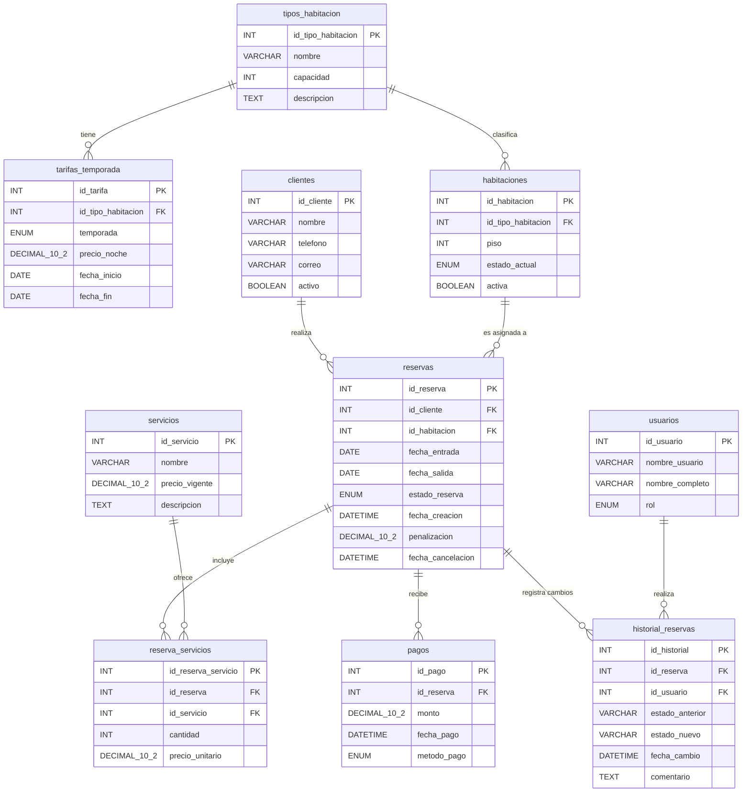

# Práctica 6: Modelo ER - Proyecto (sistema de Gestión de Citas para Hotel)

**Autores:** Angel Uriel Monterrosas Gonzalez - Noe Tlachi Zenteno  
**Matrícula:** 202339872 - 202162606  
**Institución:** Benemérita Universidad Autónoma de Puebla (BUAP)  
**Carrera:** Ingeniería en Ciencias de la Computación  
**Materia:** Base de Datos para Ingeniería  
**Profesora:** Beltran Martínez Beatriz  
**Fecha:** 16 de junio de 2026

---

## 1. Descripción del Proyecto (Análisis de Requerimientos)

El objetivo de este proyecto es diseñar una base de datos relacional robusta para gestionar las reservas de un hotel. El sistema abarca la gestión de clientes, catálogo de habitaciones con tarifas dinámicas por temporada, control de inventario, registro de servicios adicionales, pagos y un historial de auditoría.

### Requerimientos Funcionales (RF)
* **RF1 - Gestión de clientes:** Registro, modificación y borrado lógico de huéspedes.
* **RF2 - Catálogo de tipos de habitación:** Definición de categorías (simple, doble, suite) y tarifas estacionales (alta/baja).
* **RF3 - Inventario de habitaciones:** Control de estado (disponible, ocupada, en mantenimiento) por cada unidad física.
* **RF4 - Creación de reservas:** Asignación de fechas sin solapamientos, vinculando clientes y habitaciones.
* **RF5 - Cancelación de reservas:** Liberación de habitaciones y aplicación de políticas de cancelación.
* **RF6 - Servicios adicionales:** Inclusión de extras (desayuno, spa) con congelamiento de precios al momento de la reserva.
* **RF7 - Registro de pagos:** Control de abonos totales o parciales indicando método de pago.
* **RF8 - Consulta de disponibilidad:** Búsqueda ágil de habitaciones libres por rango de fechas.
* **RF9 - Facturación al checkout:** Cálculo automático de saldo pendiente (noches + servicios - abonos).
* **RF10 - Historial de cambios:** Auditoría para registrar qué usuario modificó el estado de una reserva y cuándo.

### Requerimientos No Funcionales Clave (RNF)
* **RNF3 - Consistencia:** Prevención a nivel de base de datos de dobles reservas y fechas ilógicas (salida antes de entrada).
* **RNF5 - seguridad:** Protección de datos financieros, guardando solo el método de pago sin datos sensibles de tarjetas.
* **RNF6 - Escalabilidad:** Diseño normalizado que permite incorporar nuevas sucursales, habitaciones o servicios sin alterar el esquema base.

---

## 2. Diagrama Entidad-Relación (ER)

A partir de los requerimientos establecidos, se ha modelado el siguiente esquema relacional que garantiza la integridad referencial y evita la redundancia de datos.

  

## 3. Diccionario de Datos

A continuación, se define la estructura técnica de cada entidad perteneciente al modelo:

### Tabla: `usuarios`
**Descripción:** Personal que puede gestionar reservas. Necesario para el historial de cambios.

| Columna | Tipo de dato | Longitud / Precisión | ¿Nulo? | Clave | Descripción |
|---------|--------------|----------------------|--------|-------|-------------|
| `id_usuario` | `INT` | - | No | **PK** | Identificador del usuario (Auto_increment). |
| `nombre_usuario` | `VARCHAR` | 50 | No | - | Nombre de usuario para login. |
| `nombre_completo`| `VARCHAR` | 100 | No | - | Nombre real del empleado. |
| `rol` | `ENUM` | ('ADMIN','RECEPCIONISTA') | No | - | Rol dentro del sistema. |

### Tabla: `clientes`
**Descripción:** Almacena los datos de los huéspedes. soporta borrado lógico.

| Columna | Tipo de dato | Longitud / Precisión | ¿Nulo? | Clave | Descripción |
|---------|--------------|----------------------|--------|-------|-------------|
| `id_cliente` | `INT` | - | No | **PK** | Identificador único del cliente (Auto_increment). |
| `nombre` | `VARCHAR` | 100 | No | - | Nombre completo del cliente. |
| `telefono` | `VARCHAR` | 20 | Sí | - | Número de contacto. |
| `correo` | `VARCHAR` | 100 | Sí | - | Correo electrónico (`UNIQUE`). |
| `activo` | `BOOLEAN` | - | No | - | Indica si el cliente está activo (Default: TRUE). |

### Tabla: `tipos_habitacion`
**Descripción:** Catálogo de categorías de habitaciones disponibles.

| Columna | Tipo de dato | Longitud / Precisión | ¿Nulo? | Clave | Descripción |
|---------|--------------|----------------------|--------|-------|-------------|
| `id_tipo_habitacion`| `INT` | - | No | **PK** | Identificador del tipo (Auto_increment). |
| `nombre` | `VARCHAR` | 50 | No | - | Nombre (Ej. "Simple", "Doble", "Suite"). |
| `capacidad` | `INT` | - | No | - | Número máximo de personas (> 0). |
| `descripcion` | `TEXT` | - | Sí | - | Detalles y amenidades de la habitación. |

### Tabla: `tarifas_temporada`
**Descripción:** Define precios por tipo de habitación según temporada (alta/baja).

| Columna | Tipo de dato | Longitud / Precisión | ¿Nulo? | Clave | Descripción |
|---------|--------------|----------------------|--------|-------|-------------|
| `id_tarifa` | `INT` | - | No | **PK** | Identificador de la tarifa (Auto_increment). |
| `id_tipo_habitacion`| `INT` | - | No | **FK** | Referencia al tipo de habitación. |
| `temporada` | `ENUM` | ('ALTA','BAJA') | No | - | Época de aplicación. |
| `precio_noche` | `DECIMAL` | 10,2 | No | - | Precio por noche en esa temporada. |
| `fecha_inicio` | `DATE` | - | No | - | Fecha de inicio de vigencia. |
| `fecha_fin` | `DATE` | - | No | - | Fecha de fin de vigencia. |

### Tabla: `habitaciones`
**Descripción:** Registro físico de cada habitación con su estado actual.

| Columna | Tipo de dato | Longitud / Precisión | ¿Nulo? | Clave | Descripción |
|---------|--------------|----------------------|--------|-------|-------------|
| `id_habitacion` | `INT` | - | No | **PK** | Número identificador de habitación. |
| `id_tipo_habitacion`| `INT` | - | No | **FK** | Categoría de la habitación. |
| `piso` | `INT` | - | No | - | Número de piso o nivel. |
| `estado_actual` | `ENUM` | ('DISPONIBLE','OCUPADA','MANTENIMIENTO') | No | - | Disponibilidad actual. |
| `activa` | `BOOLEAN` | - | No | - | Operatividad física (Default: TRUE). |

### Tabla: `reservas`
**Descripción:** Entidad central que vincula clientes con habitaciones en fechas específicas.

| Columna | Tipo de dato | Longitud / Precisión | ¿Nulo? | Clave | Descripción |
|---------|--------------|----------------------|--------|-------|-------------|
| `id_reserva` | `INT` | - | No | **PK** | Identificador de la reserva. |
| `id_cliente` | `INT` | - | No | **FK** | Cliente titular. |
| `id_habitacion` | `INT` | - | No | **FK** | Habitación asignada. |
| `fecha_entrada` | `DATE` | - | No | - | Check-in. |
| `fecha_salida` | `DATE` | - | No | - | Check-out (`fecha_salida > fecha_entrada`). |
| `estado_reserva` | `ENUM` | ('ACTIVA','CONFIRMADA','CANCELADA','COMPLETADA') | No | - | Situación actual de la reserva. |
| `fecha_creacion` | `DATETIME` | - | No | - | Timestamp de creación. |
| `penalizacion` | `DECIMAL` | 10,2 | Sí | - | Cobro por cancelación tardía. |
| `fecha_cancelacion` | `DATETIME` | - | Sí | - | Fecha de anulación si aplica. |

### Tabla: `servicios`
**Descripción:** Catálogo de servicios extras ofrecidos por el hotel.

| Columna | Tipo de dato | Longitud / Precisión | ¿Nulo? | Clave | Descripción |
|---------|--------------|----------------------|--------|-------|-------------|
| `id_servicio` | `INT` | - | No | **PK** | Identificador del servicio extra. |
| `nombre` | `VARCHAR` | 100 | No | - | Ej. Desayuno buffet, Spa. |
| `precio_vigente` | `DECIMAL` | 10,2 | No | - | Costo actual. |
| `descripcion` | `TEXT` | - | Sí | - | Detalles adicionales. |

### Tabla: `reserva_servicios`
**Descripción:** Rompe la relación muchos a muchos entre reservas y servicios, congelando precios.

| Columna | Tipo de dato | Longitud / Precisión | ¿Nulo? | Clave | Descripción |
|---------|--------------|----------------------|--------|-------|-------------|
| `id_reserva_servicio`| `INT` | - | No | **PK** | Identificador único de consumo. |
| `id_reserva` | `INT` | - | No | **FK** | Reserva a la que se carga. |
| `id_servicio` | `INT` | - | No | **FK** | Servicio consumido. |
| `cantidad` | `INT` | - | No | - | Unidades solicitadas. |
| `precio_unitario` | `DECIMAL` | 10,2 | No | - | Precio cobrado en ese momento histórico. |

### Tabla: `pagos`
**Descripción:** Registro de transacciones financieras a favor de una reserva.

| Columna | Tipo de dato | Longitud / Precisión | ¿Nulo? | Clave | Descripción |
|---------|--------------|----------------------|--------|-------|-------------|
| `id_pago` | `INT` | - | No | **PK** | Identificador del ticket o abono. |
| `id_reserva` | `INT` | - | No | **FK** | Reserva liquidada. |
| `monto` | `DECIMAL` | 10,2 | No | - | Cantidad pagada. |
| `fecha_pago` | `DATETIME` | - | No | - | Momento exacto del cobro. |
| `metodo_pago` | `ENUM` | ('EFECTIVO','TARJETA','TRANSFERENCIA') | No | - | Vía de pago utilizada. |

### Tabla: `historial_reservas`
**Descripción:** Bitácora de auditoría para cambios de estado (RF10).

| Columna | Tipo de dato | Longitud / Precisión | ¿Nulo? | Clave | Descripción |
|---------|--------------|----------------------|--------|-------|-------------|
| `id_historial` | `INT` | - | No | **PK** | ID del registro de auditoría. |
| `id_reserva` | `INT` | - | No | **FK** | Reserva afectada. |
| `id_usuario` | `INT` | - | No | **FK** | Empleado responsable del cambio. |
| `estado_anterior` | `VARCHAR` | 20 | No | - | Estado previo. |
| `estado_nuevo` | `VARCHAR` | 20 | No | - | Estado posterior. |
| `fecha_cambio` | `DATETIME` | - | No | - | Momento del suceso. |
| `comentario` | `TEXT` | - | Sí | - | Observaciones o motivos del cambio. |

---

## 4. Conclusión
El diseño propuesto aborda eficazmente los procesos operativos de un hotel. La normalización aplicada (identificable en tablas como `reserva_servicios` y `tarifas_temporada`) previene anomalías de actualización y eliminación. Además, la incorporación de un `historial_reservas` y restricciones estrictas a nivel base de datos proporcionan una capa indispensable de seguridad, auditoría y consistencia a largo plazo para el proyecto de ingeniería.