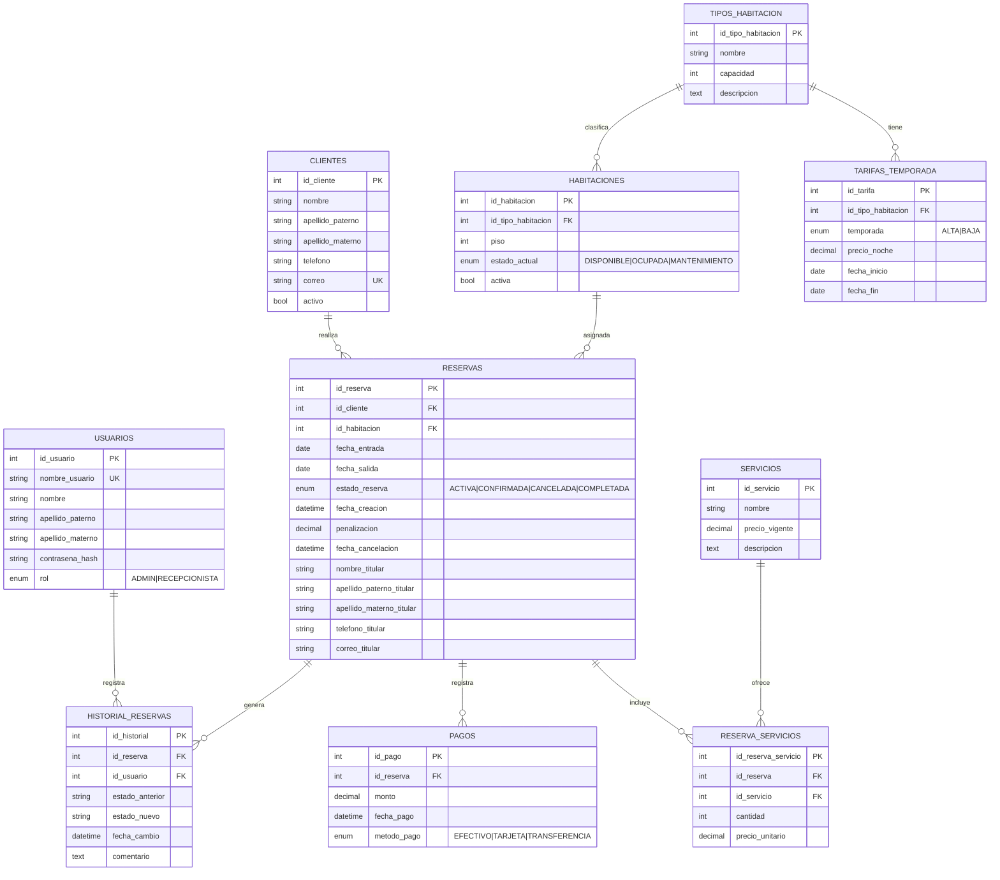
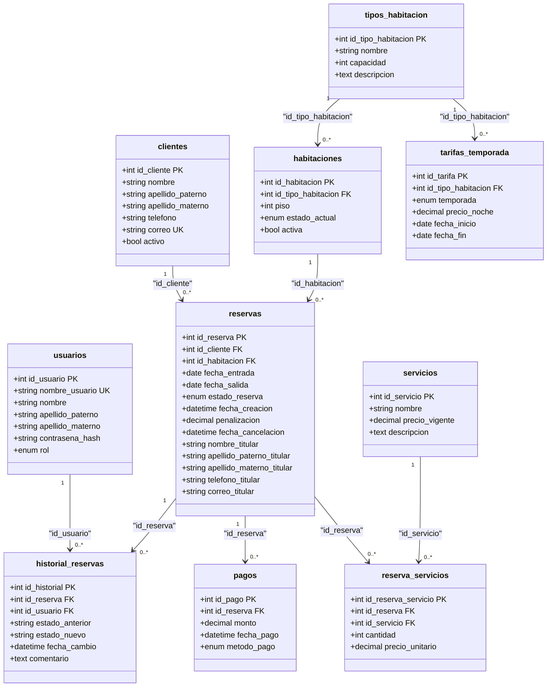

# Modelo ER, Relacional y Normalización - Proyecto (Sistema de Gestión de Citas para Hotel)

**Autores:** Angel Uriel Monterrosas Gonzalez - Noe Tlachi Zenteno  
**Matrícula:** 202339872 - 202162606  
**Institución:** Benemérita Universidad Autónoma de Puebla (BUAP)  
**Carrera:** Licenciatura en Ingeniería en Ciencias de la Computación  
**Materia:** Base de Datos para Ingeniería  
**Profesora:** Beltran Martínez Beatriz  
**Fecha:** 16 de junio de 2026

---

## 1. Descripción del Proyecto (Análisis de Requerimientos)
# Descripción del Proyecto (Análisis de Requerimientos)

El objetivo es diseñar una base de datos relacional robusta para gestionar las reservas de un hotel. El sistema abarca la gestión de clientes, catálogo de habitaciones con tarifas dinámicas por temporada, control de inventario, registro de servicios adicionales, pagos y un historial de auditoría. Se incluye un esquema de roles (Administrador y Recepcionista) para controlar el acceso a las funcionalidades.

## Requerimientos Funcionales (RF)

- **RF1 - Gestión de clientes:** Registro, modificación y borrado lógico de huéspedes.
- **RF2 - Catálogo de tipos de habitación:** Definición de categorías (simple, doble, suite) y tarifas estacionales (alta/baja).
- **RF3 - Inventario de habitaciones:** Control de estado (disponible, ocupada, en mantenimiento) por cada unidad física.
- **RF4 - Creación de reservas:** Asignación de fechas sin solapamientos, vinculando clientes y habitaciones. Además, al momento de crear la reserva se debe almacenar una copia de los datos del titular (nombre, apellidos, teléfono, correo) para conservar la información histórica.
- **RF5 - Cancelación de reservas:** Liberación de habitaciones y aplicación de políticas de cancelación.
- **RF6 - Servicios adicionales:** Inclusión de extras (desayuno, spa) con congelamiento de precios al momento de la reserva.
- **RF7 - Registro de pagos:** Control de abonos totales o parciales indicando método de pago.
- **RF8 - Consulta de disponibilidad:** Búsqueda ágil de habitaciones libres por rango de fechas.
- **RF9 - Facturación al checkout:** Cálculo automático de saldo pendiente (noches + servicios - abonos).
- **RF10 - Historial de cambios:** Auditoría para registrar qué usuario modificó el estado de una reserva y cuándo.

## Requerimientos No Funcionales Clave (RNF)

- **RNF3 - Consistencia:** Prevención a nivel de base de datos de dobles reservas y fechas ilógicas (salida antes de entrada).
- **RNF5 - Seguridad:** Protección de datos financieros, guardando solo el método de pago sin datos sensibles de tarjetas. Además, las contraseñas de los usuarios se almacenan únicamente mediante un hash criptográfico (bcrypt/Argon2) para garantizar su confidencialidad.
- **RNF6 - Escalabilidad:** Diseño normalizado que permite incorporar nuevas sucursales, habitaciones o servicios sin alterar el esquema base.

## Roles y Permisos

Se definen dos roles:

### Administrador (ADMIN)

- Acceso total a todas las funciones del sistema.
- Gestión de usuarios (crear, modificar, eliminar) y asignación de roles.
- Gestión de catálogos (tipos de habitación, tarifas, servicios).
- Consulta y modificación de cualquier reserva.
- Auditoría completa (historial).

### Recepcionista (RECEPCIONISTA)

- Gestión de clientes (crear, modificar, consultar).
- Creación y cancelación de reservas (sobre las habitaciones disponibles).
- Registro de pagos.
- Consulta de disponibilidad.
- No puede modificar tarifas, catálogos ni usuarios.

## 2. Evolución del Modelo y Normalización

Para garantizar la integridad referencial, evitar anomalías de actualización y eliminar redundancias, el modelo conceptual inicial fue sometido a un proceso de normalización hasta alcanzar la **Tercera Forma Normal (3NF)**.

### 2.1 Modelo Entidad-Relación Inicial (Antes)

En la fase conceptual, se identifican las entidades principales y las reglas de negocio. En este punto, existen relaciones de muchos a muchos (M:N), como la de `RESERVAS` y `SERVICIOS`.




### 2.2 Modelo Relacional Normalizado (Después)

El siguiente diagrama de clases muestra el modelo relacional con todas las tablas, sus claves primarias (PK) y foráneas (FK), garantizando que cada tabla cumple con 3NF (atributos atómicos, sin dependencias parciales ni transitivas).



---
## Observaciones

- Todas las tablas tienen una clave primaria simple y autoincrementable.
- Las claves foráneas garantizan la integridad referencial con eliminación en cascada (ON DELETE CASCADE).
- No existen dependencias transitivas: los atributos no clave dependen directamente de la clave primaria de su tabla.
- Los campos como `nombre_titular`, etc., en reservas son copias históricas, no dependen de clientes para preservar la información.
## 3. Diccionario de Datos (Modelo Normalizado 3NF)

A continuación, se define la estructura técnica de cada entidad en su estado final.

## Diccionario de Datos

| Tabla | Descripción | Permisos |
|-------|-------------|----------|
| **usuarios** | Personal que gestiona el sistema. | ADMIN o RECEPCIONISTA |

| Columna | Tipo | Nulabilidad | Descripción |
|---------|------|-------------|-------------|
| `id_usuario` | INT | NO NULO | PK, autoincrementable |
| `nombre_usuario` | VARCHAR(50) | NO NULO | ÚNICO |
| `nombre` | VARCHAR(50) | NO NULO | - |
| `apellido_paterno` | VARCHAR(50) | NO NULO | - |
| `apellido_materno` | VARCHAR(50) | NULO | - |
| `contrasena_hash` | VARCHAR(255) | NO NULO | Almacena el hash de la contraseña |
| `rol` | ENUM('ADMIN','RECEPCIONISTA') | NO NULO | - |

---

| Tabla | Descripción |
|-------|-------------|
| **clientes** | Datos de los huéspedes. Borrado lógico con `activo`. |

| Columna | Tipo | Nulabilidad | Descripción |
|---------|------|-------------|-------------|
| `id_cliente` | INT | NO NULO | PK, autoincrementable |
| `nombre` | VARCHAR(50) | NO NULO | - |
| `apellido_paterno` | VARCHAR(50) | NO NULO | - |
| `apellido_materno` | VARCHAR(50) | NULO | - |
| `telefono` | VARCHAR(20) | NULO | - |
| `correo` | VARCHAR(100) | NULO | ÚNICO |
| `activo` | BOOLEAN | NO NULO | DEFAULT TRUE |

---

| Tabla | Descripción |
|-------|-------------|
| **tipos_habitacion** | Catálogo de categorías de habitaciones. |

| Columna | Tipo | Nulabilidad | Descripción |
|---------|------|-------------|-------------|
| `id_tipo_habitacion` | INT | NO NULO | PK, autoincrementable |
| `nombre` | VARCHAR(50) | NO NULO | - |
| `capacidad` | INT | NO NULO | - |
| `descripcion` | TEXT | NULO | - |

---

| Tabla | Descripción |
|-------|-------------|
| **tarifas_temporada** | Precios por tipo de habitación y temporada. |

| Columna | Tipo | Nulabilidad | Descripción |
|---------|------|-------------|-------------|
| `id_tarifa` | INT | NO NULO | PK, autoincrementable |
| `id_tipo_habitacion` | INT | NO NULO | FK |
| `temporada` | ENUM('ALTA','BAJA') | NO NULO | - |
| `precio_noche` | DECIMAL(10,2) | NO NULO | - |
| `fecha_inicio` | DATE | NO NULO | - |
| `fecha_fin` | DATE | NO NULO | - |

---

| Tabla | Descripción |
|-------|-------------|
| **habitaciones** | Registro físico de cada habitación. |

| Columna | Tipo | Nulabilidad | Descripción |
|---------|------|-------------|-------------|
| `id_habitacion` | INT | NO NULO | PK, autoincrementable |
| `id_tipo_habitacion` | INT | NO NULO | FK |
| `piso` | INT | NO NULO | - |
| `estado_actual` | ENUM('DISPONIBLE','OCUPADA','MANTENIMIENTO') | NO NULO | DEFAULT 'DISPONIBLE' |
| `activa` | BOOLEAN | NO NULO | DEFAULT TRUE |

---

| Tabla | Descripción |
|-------|-------------|
| **reservas** | Entidad central que vincula cliente, habitación y fechas. Incluye instantánea del titular. |

| Columna | Tipo | Nulabilidad | Descripción |
|---------|------|-------------|-------------|
| `id_reserva` | INT | NO NULO | PK, autoincrementable |
| `id_cliente` | INT | NO NULO | FK |
| `id_habitacion` | INT | NO NULO | FK |
| `fecha_entrada` | DATE | NO NULO | - |
| `fecha_salida` | DATE | NO NULO | - |
| `estado_reserva` | ENUM('ACTIVA','CONFIRMADA','CANCELADA','COMPLETADA') | NO NULO | DEFAULT 'ACTIVA' |
| `fecha_creacion` | DATETIME | NO NULO | DEFAULT CURRENT_TIMESTAMP |
| `penalizacion` | DECIMAL(10,2) | NULO | - |
| `fecha_cancelacion` | DATETIME | NULO | - |
| `nombre_titular` | VARCHAR(50) | NO NULO | Copia histórica |
| `apellido_paterno_titular` | VARCHAR(50) | NO NULO | Copia histórica |
| `apellido_materno_titular` | VARCHAR(50) | NULO | Copia histórica |
| `telefono_titular` | VARCHAR(20) | NULO | Copia histórica |
| `correo_titular` | VARCHAR(100) | NULO | Copia histórica |

---

| Tabla | Descripción |
|-------|-------------|
| **servicios** | Catálogo de servicios extras. |

| Columna | Tipo | Nulabilidad | Descripción |
|---------|------|-------------|-------------|
| `id_servicio` | INT | NO NULO | PK, autoincrementable |
| `nombre` | VARCHAR(100) | NO NULO | - |
| `precio_vigente` | DECIMAL(10,2) | NO NULO | - |
| `descripcion` | TEXT | NULO | - |

---

| Tabla | Descripción |
|-------|-------------|
| **reserva_servicios** | Tabla puente para servicios consumidos, con precio congelado. |

| Columna | Tipo | Nulabilidad | Descripción |
|---------|------|-------------|-------------|
| `id_reserva_servicio` | INT | NO NULO | PK, autoincrementable |
| `id_reserva` | INT | NO NULO | FK |
| `id_servicio` | INT | NO NULO | FK |
| `cantidad` | INT | NO NULO | - |
| `precio_unitario` | DECIMAL(10,2) | NO NULO | Precio congelado al momento de la reserva |

---

| Tabla | Descripción |
|-------|-------------|
| **pagos** | Registro de abonos a una reserva. |

| Columna | Tipo | Nulabilidad | Descripción |
|---------|------|-------------|-------------|
| `id_pago` | INT | NO NULO | PK, autoincrementable |
| `id_reserva` | INT | NO NULO | FK |
| `monto` | DECIMAL(10,2) | NO NULO | - |
| `fecha_pago` | DATETIME | NO NULO | DEFAULT CURRENT_TIMESTAMP |
| `metodo_pago` | ENUM('EFECTIVO','TARJETA','TRANSFERENCIA') | NO NULO | - |

---

| Tabla | Descripción |
|-------|-------------|
| **historial_reservas** | Bitácora de auditoría de cambios de estado. |

| Columna | Tipo | Nulabilidad | Descripción |
|---------|------|-------------|-------------|
| `id_historial` | INT | NO NULO | PK, autoincrementable |
| `id_reserva` | INT | NO NULO | FK |
| `id_usuario` | INT | NO NULO | FK |
| `estado_anterior` | VARCHAR(20) | NO NULO | - |
| `estado_nuevo` | VARCHAR(20) | NO NULO | - |
| `fecha_cambio` | DATETIME | NO NULO | DEFAULT CURRENT_TIMESTAMP |
| `comentario` | TEXT | NULO | - |
---

## 4. Script de Base de Datos (SQL DDL)

El siguiente script crea la base de datos y todas las tablas respetando el orden de dependencias para garantizar la integridad referencial de las claves foráneas.


```sql
-- Crear base de datos
CREATE DATABASE IF NOT EXISTS hotel_reservas_db
CHARACTER SET utf8mb4
COLLATE utf8mb4_unicode_ci;
USE hotel_reservas_db;


-- 1. Tablas Catálogo e Independientes


CREATE TABLE tipos_habitacion (
id_tipo_habitacion INT AUTO_INCREMENT PRIMARY KEY,
nombre VARCHAR(50) NOT NULL,
capacidad INT NOT NULL,
descripcion TEXT
) ENGINE=InnoDB DEFAULT CHARSET=utf8mb4;

CREATE TABLE servicios (
id_servicio INT AUTO_INCREMENT PRIMARY KEY,
nombre VARCHAR(100) NOT NULL,
precio_vigente DECIMAL(10,2) NOT NULL,
descripcion TEXT
) ENGINE=InnoDB DEFAULT CHARSET=utf8mb4;

CREATE TABLE clientes (
id_cliente INT AUTO_INCREMENT PRIMARY KEY,
nombre VARCHAR(50) NOT NULL,
apellido_paterno VARCHAR(50) NOT NULL,
apellido_materno VARCHAR(50),
telefono VARCHAR(20),
correo VARCHAR(100) UNIQUE,
activo BOOLEAN NOT NULL DEFAULT TRUE
) ENGINE=InnoDB DEFAULT CHARSET=utf8mb4;

CREATE TABLE usuarios (
id_usuario INT AUTO_INCREMENT PRIMARY KEY,
nombre_usuario VARCHAR(50) NOT NULL UNIQUE,
nombre VARCHAR(50) NOT NULL,
apellido_paterno VARCHAR(50) NOT NULL,
apellido_materno VARCHAR(50),
contrasena_hash VARCHAR(255) NOT NULL,
rol ENUM('ADMIN', 'RECEPCIONISTA') NOT NULL
) ENGINE=InnoDB DEFAULT CHARSET=utf8mb4;

-- ==========================================
-- 2. Tablas con Dependencias Nivel 1
-- ==========================================

CREATE TABLE tarifas_temporada (
id_tarifa INT AUTO_INCREMENT PRIMARY KEY,
id_tipo_habitacion INT NOT NULL,
temporada ENUM('ALTA', 'BAJA') NOT NULL,
precio_noche DECIMAL(10,2) NOT NULL,
fecha_inicio DATE NOT NULL,
fecha_fin DATE NOT NULL,
FOREIGN KEY (id_tipo_habitacion)
REFERENCES tipos_habitacion(id_tipo_habitacion)
ON DELETE CASCADE,
CHECK (fecha_fin >= fecha_inicio)
) ENGINE=InnoDB DEFAULT CHARSET=utf8mb4;

CREATE TABLE habitaciones (
id_habitacion INT PRIMARY KEY,
id_tipo_habitacion INT NOT NULL,
piso INT NOT NULL,
estado_actual ENUM('DISPONIBLE', 'OCUPADA', 'MANTENIMIENTO')
NOT NULL DEFAULT 'DISPONIBLE',
activa BOOLEAN NOT NULL DEFAULT TRUE,
FOREIGN KEY (id_tipo_habitacion)
REFERENCES tipos_habitacion(id_tipo_habitacion)
ON DELETE CASCADE
) ENGINE=InnoDB DEFAULT CHARSET=utf8mb4;

-- ==========================================
-- 3. Tabla Central: RESERVAS (con datos del titular)
-- ==========================================

CREATE TABLE reservas (
id_reserva INT AUTO_INCREMENT PRIMARY KEY,
id_cliente INT NOT NULL,
id_habitacion INT NOT NULL,
fecha_entrada DATE NOT NULL,
fecha_salida DATE NOT NULL,
estado_reserva ENUM('ACTIVA', 'CONFIRMADA', 'CANCELADA', 'COMPLETADA')
NOT NULL DEFAULT 'ACTIVA',
fecha_creacion DATETIME NOT NULL DEFAULT CURRENT_TIMESTAMP,
penalizacion DECIMAL(10,2),
fecha_cancelacion DATETIME,
-- Datos del titular (instantánea histórica)
nombre_titular VARCHAR(50) NOT NULL,
apellido_paterno_titular VARCHAR(50) NOT NULL,
apellido_materno_titular VARCHAR(50),
telefono_titular VARCHAR(20),
correo_titular VARCHAR(100),
FOREIGN KEY (id_cliente) REFERENCES clientes(id_cliente) ON DELETE CASCADE,
FOREIGN KEY (id_habitacion) REFERENCES habitaciones(id_habitacion) ON DELETE CASCADE,
CHECK (fecha_salida > fecha_entrada)
) ENGINE=InnoDB DEFAULT CHARSET=utf8mb4;

-- Índice para búsqueda de disponibilidad por fechas
CREATE INDEX idx_reservas_fechas ON reservas(fecha_entrada, fecha_salida);

-- ==========================================
-- 4. Tablas Operativas (Dependencias Nivel 3)
-- ==========================================

CREATE TABLE reserva_servicios (
id_reserva_servicio INT AUTO_INCREMENT PRIMARY KEY,
id_reserva INT NOT NULL,
id_servicio INT NOT NULL,
cantidad INT NOT NULL,
precio_unitario DECIMAL(10,2) NOT NULL,
FOREIGN KEY (id_reserva) REFERENCES reservas(id_reserva) ON DELETE CASCADE,
FOREIGN KEY (id_servicio) REFERENCES servicios(id_servicio) ON DELETE CASCADE,
CHECK (cantidad > 0)
) ENGINE=InnoDB DEFAULT CHARSET=utf8mb4;

CREATE TABLE pagos (
id_pago INT AUTO_INCREMENT PRIMARY KEY,
id_reserva INT NOT NULL,
monto DECIMAL(10,2) NOT NULL,
fecha_pago DATETIME NOT NULL DEFAULT CURRENT_TIMESTAMP,
metodo_pago ENUM('EFECTIVO', 'TARJETA', 'TRANSFERENCIA') NOT NULL,
FOREIGN KEY (id_reserva) REFERENCES reservas(id_reserva) ON DELETE CASCADE,
CHECK (monto > 0)
) ENGINE=InnoDB DEFAULT CHARSET=utf8mb4;

CREATE TABLE historial_reservas (
id_historial INT AUTO_INCREMENT PRIMARY KEY,
id_reserva INT NOT NULL,
id_usuario INT NOT NULL,
estado_anterior VARCHAR(20) NOT NULL,
estado_nuevo VARCHAR(20) NOT NULL,
fecha_cambio DATETIME NOT NULL DEFAULT CURRENT_TIMESTAMP,
comentario TEXT,
FOREIGN KEY (id_reserva) REFERENCES reservas(id_reserva) ON DELETE CASCADE,
FOREIGN KEY (id_usuario) REFERENCES usuarios(id_usuario) ON DELETE CASCADE
) ENGINE=InnoDB DEFAULT CHARSET=utf8mb4;

```
Datos de prueba:
```sql
-- ==========================================
-- 5. Datos de Prueba 
-- ==========================================

INSERT INTO tipos_habitacion (nombre, capacidad, descripcion) VALUES
('Simple', 1, 'Habitación individual con cama sencilla'),
('Doble', 2, 'Habitación con cama matrimonial o dos camas individuales'),
('Suite', 4, 'Suite con sala y recámara separada');

INSERT INTO servicios (nombre, precio_vigente, descripcion) VALUES
('Desayuno buffet', 150.00, 'Desayuno completo tipo buffet'),
('Spa', 500.00, 'Acceso al spa y masaje de 30 min'),
('Estacionamiento', 100.00, 'Estacionamiento cubierto por noche');

-- Usuarios de prueba (las contraseñas se gestionan con password_hash() en la aplicación)
-- Los hash mostrados son ilustrativos; se deben generar con password_hash('admin123', PASSWORD_BCRYPT)
INSERT INTO usuarios (nombre_usuario, nombre, apellido_paterno, apellido_materno, contrasena_hash, rol) VALUES
('admin', 'Admin', 'Principal', NULL, '$2y$10$e0MYzXjYx7ZQZJ2QZJ2QZuZQZJ2QZJ2QZJ2QZJ2QZJ2QZJ2QZJ2QZJ2', 'ADMIN'),
('recepcionista1', 'Ana', 'Pérez', 'Gómez', '$2y$10$f0FyYkYlYkYlYkYlYkYlYkYlYkYlYkYlYkYlYkYlYkYlYkYlYkYlY', 'RECEPCIONISTA');
```

## 5. Estructura de Carpetas del Proyecto
```text
proyecto-hotel/
├── backend/
│   ├── config/
│   │   └── database.php          # Configuración de conexión a BD
│   ├── models/
│   │   ├── Usuario.php
│   │   ├── Cliente.php
│   │   ├── Habitacion.php
│   │   ├── Reserva.php
│   │   ├── Servicio.php
│   │   ├── Pago.php
│   │   └── Historial.php
│   ├── controllers/
│   │   ├── AuthController.php    # Maneja login/logout y verificación de contraseñas
│   │   ├── ClienteController.php
│   │   ├── ReservaController.php
│   │   ├── HabitacionController.php
│   │   ├── ServicioController.php
│   │   ├── PagoController.php
│   │   └── ReporteController.php
│   ├── routes/
│   │   └── api.php               # Definición de rutas (endpoints)
│   ├── helpers/
│   │   ├── validator.php
│   │   └── auth.php              # Middleware de autenticación y roles
│   └── middleware/
│       └── RoleMiddleware.php    # Verificación de permisos por rol
├── frontend/
│   ├── public/
│   │   ├── css/
│   │   │   └── style.css         # TODOS los estilos visuales del sistema
│   │   ├── js/
│   │   │   └── app.js            # TODAS las validaciones de campos en cliente (JavaScript)
│   │   └── images/
│   ├── views/
│   │   ├── auth/
│   │   │   ├── login.php
│   │   │   └── logout.php
│   │   ├── clientes/
│   │   │   ├── listar.php
│   │   │   ├── crear.php
│   │   │   └── editar.php
│   │   ├── habitaciones/
│   │   │   ├── disponibilidad.php
│   │   │   └── gestion.php
│   │   ├── reservas/
│   │   │   ├── crear.php
│   │   │   ├── listar.php
│   │   │   ├── detalle.php
│   │   │   └── cancelar.php
│   │   ├── servicios/
│   │   │   └── catalogo.php
│   │   ├── pagos/
│   │   │   └── registrar.php
│   │   ├── reportes/
│   │   │   └── index.php
│   │   ├── usuarios/             # Solo ADMIN
│   │   │   ├── listar.php
│   │   │   ├── crear.php
│   │   │   └── editar.php
│   │   ├── dashboard/
│   │   │   └── index.php
│   │   └── layout/
│   │       ├── header.php
│   │       └── footer.php
│   └── index.php                 # Punto de entrada (redirige a login o dashboard)
├── database/
│   └── schema.sql                # Script SQL completo (el generado arriba)
├── docs/
│   ├── manual_usuario.md
│   └── manual_tecnico.md
├── .htaccess                     # Configuración de rutas amigables
├── composer.json                 # Dependencias PHP (si aplica)
└── README.md
``` 
# Lógica de Negocio y Flujos de Trabajo (Funcionalidad Detallada)

Esta sección describe cómo interactúan los componentes para cumplir con los requerimientos funcionales, garantizando la consistencia de los datos y la correcta ejecución de los procesos.

---

## 6.1. Autenticacion de Usuarios (Login) – Incorporacion de contraseña

- El formulario de login solicita `nombre_usuario` y `contrasena`.
- El backend (controlador `AuthController`) recibe las credenciales, busca al usuario por `nombre_usuario` y, si existe, verifica la contraseña usando `password_verify()` contra el hash almacenado en `contrasena_hash`.
- Si la verificación es exitosa, se inicia la sesión y se guarda el rol del usuario para control de acceso.
- En caso de fallo, se registra el intento (opcional) y se devuelve un error genérico.
- Las contraseñas nunca se almacenan en texto plano; solo el hash generado con `password_hash()` (bcrypt por defecto) se guarda en la base de datos.

---

## 6.2. Gestion de Clientes (RF1)

- El recepcionista o administrador puede dar de alta un nuevo cliente. Se validan campos (nombre, apellidos, teléfono, correo) mediante JavaScript en el frontend.
- El correo debe ser único en la tabla `clientes` (restricción `UNIQUE`). Si se intenta duplicar, el backend devuelve un error.
- El borrado es lógico: se cambia el campo `activo` a `FALSE`. Las reservas históricas permanecen, pero el cliente no aparecerá en las búsquedas activas.
- Al modificar un cliente, se actualiza su registro. No se afectan reservas pasadas (los datos del titular ya fueron copiados en `reservas`).

---

## 6.3. Catalogo de Tipos de Habitacion y Tarifas (RF2)

- El administrador gestiona los tipos de habitación (`tipos_habitacion`) y sus tarifas por temporada (`tarifas_temporada`).
- Para cada tipo, se definen precios para temporada `ALTA` y `BAJA` con fechas de vigencia. El sistema valida que `fecha_fin >= fecha_inicio`.
- Al calcular el costo de una reserva, se busca la tarifa que corresponda a la `fecha_entrada` de la estancia (si la estancia abarca varios días, se podría prorratear, pero en este diseño se toma la tarifa vigente al día de entrada como precio fijo para toda la estancia, simplificando).
- Si un precio cambia, solo afecta a nuevas reservas, no a las ya creadas (porque el precio se congela en `reservas` a través del cálculo que se hace al momento de la reserva).

---

## 6.4. Inventario de Habitaciones (RF3)

- Cada habitación física (`habitaciones`) tiene un estado: `DISPONIBLE`, `OCUPADA` o `MANTENIMIENTO`.
- Solo las habitaciones con estado `DISPONIBLE` y activa (`activa = TRUE`) pueden ser reservadas.
- Cuando se crea una reserva, la habitación pasa automáticamente a `OCUPADA` (si la reserva es confirmada). Al finalizar la estancia (checkout) se actualiza a `DISPONIBLE`.
- El mantenimiento puede ser activado manualmente por el administrador.

---

## 6.5. Creacion de Reservas (RF4) – Paso a paso

1. El usuario (recepcionista o admin) selecciona un cliente existente o lo crea en el momento.
2. Se eligen las fechas de entrada y salida. JavaScript valida que `fecha_salida > fecha_entrada`.
3. Se consulta la disponibilidad (RF8) mediante una consulta SQL que verifica que no existan reservas activas o confirmadas para esa habitación en el rango de fechas.
4. Se selecciona una habitación disponible del tipo deseado.
5. Se calcula el costo de las noches: se obtiene la tarifa de `tarifas_temporada` para el tipo de habitación y la temporada de la fecha de entrada.
6. Se toman los datos del cliente y se copian en los campos `nombre_titular`, `apellido_paterno_titular`, etc., de la tabla `reservas`. Esto asegura que aunque el cliente modifique sus datos después, la reserva conserve la información original.
7. Se crea el registro en `reservas` con estado `ACTIVA` (o `CONFIRMADA` si se requiere un paso adicional). Se registra la fecha de creación.
8. La habitación se marca como `OCUPADA` (si la reserva es confirmada) o se deja en `DISPONIBLE` si solo es una reserva provisional (según política del hotel).
9. Se genera un registro en `historial_reservas` con el cambio de estado (de `NULL` a `ACTIVA` o `CONFIRMADA`) y el usuario que la creó.
10. Se pueden agregar servicios adicionales (RF6) en este paso o posteriormente.

---

## 6.6. Servicios Adicionales (RF6)

- Los servicios se eligen de un catálogo (`servicios`). Al agregarlos a una reserva, se guardan en `reserva_servicios` con el precio unitario vigente en ese momento (`precio_unitario`), congelando así el costo.
- Se permite modificar la cantidad de un servicio antes del checkout; el precio unitario permanece congelado.
- El total de servicios se calcula como `SUM(cantidad * precio_unitario)` para la facturación.

---

## 6.7. Registro de Pagos (RF7)

- Los pagos se registran en la tabla `pagos` asociados a una reserva. Se puede registrar un abono parcial o el total.
- El método de pago se almacena (`EFECTIVO`, `TARJETA`, `TRANSFERENCIA`). No se almacenan datos sensibles (RNF5).
- El monto debe ser positivo y no se valida contra el total adeudado en el momento del registro (se puede aceptar sobrepago, pero el sistema lo mostrará en el saldo).
- Cada pago queda registrado con su fecha.

---

## 6.8. Cancelacion de Reservas (RF5)

- Solo se pueden cancelar reservas con estado `ACTIVA` o `CONFIRMADA`.
- Al cancelar, se calcula una penalización según la política (por ejemplo, si la cancelación es con menos de 48 horas de anticipación, se cobra el 50% de la primera noche). Este valor se almacena en `penalizacion`.
- La habitación se libera (cambia a `DISPONIBLE`) si no está ocupada físicamente.
- El estado de la reserva pasa a `CANCELADA` y se registra la `fecha_cancelacion`.
- Se genera un registro en `historial_reservas` indicando el cambio y el usuario que lo realizó.
- Los pagos ya registrados permanecen; el saldo pendiente se recalcula para la facturación final.

---

## 6.9. Consulta de Disponibilidad (RF8)

- Se realiza una consulta SQL que utiliza el índice `idx_reservas_fechas` para obtener rápidamente las habitaciones que no tienen reservas activas o confirmadas en el rango solicitado.
- La consulta filtra también por `estado_actual = 'DISPONIBLE'` y `activa = TRUE`.
- La interfaz muestra las habitaciones disponibles con su tipo y precio estimado.

---

## 6.10. Facturacion al Checkout (RF9)

Al finalizar la estancia, el sistema calcula el total a pagar:

- **Costo de noches:** `DATEDIFF(fecha_salida, fecha_entrada) * precio_noche` (precio tomado de la tarifa correspondiente a la fecha de entrada).
- **Total servicios:** suma de `cantidad * precio_unitario` de `reserva_servicios`.
- **Total pagado:** suma de `monto` de `pagos`.
- **Saldo pendiente:** `costo_noches + total_servicios - total_pagado - penalizacion` (si aplica).

El sistema presenta esta factura al recepcionista, quien puede registrar un pago final para saldar la cuenta.

Una vez saldada, se cambia el estado de la reserva a `COMPLETADA` y la habitación se libera (`DISPONIBLE`).

Se registra el evento en el historial.

---

## 6.11. Auditoria (RF10)

- Cada cambio de estado de una reserva (creación, confirmación, cancelación, checkout) se registra en `historial_reservas`.
- Se almacena el estado anterior, el nuevo, el usuario que realizó el cambio y un comentario opcional.
- Esto permite rastrear cualquier modificación y es visible solo para el administrador (y en parte para el recepcionista sobre sus propias reservas).

---

## 6.12. Consistencia y Prevencion de Anomalias

- La base de datos utiliza claves foráneas con `ON DELETE CASCADE` para mantener la integridad referencial, pero se complementa con restricciones `CHECK` y lógica de aplicación.
- Para evitar dobles reservas, la consulta de disponibilidad se ejecuta dentro de una transacción al momento de crear la reserva, bloqueando la habitación (nivel de aislamiento `READ COMMITTED` o `SERIALIZABLE` según el motor).
- Las fechas se validan tanto en frontend (JS) como en backend (PHP) y en la base de datos (`CHECK`).
- Los precios se congelan al momento de la reserva, evitando que cambios posteriores en tarifas o servicios afecten las reservas ya creadas.

---

## Estrategia de Validacion y Estilos (Separacion de Capas)

Para garantizar un código limpio, mantenible y alineado con las buenas prácticas de desarrollo web, se establece una separación tajante entre la lógica de presentación (frontend) y la lógica de negocio (backend).

### Validaciones con JavaScript (Frontend)

- Todas las validaciones de campos en el lado del cliente se realizarán **EXCLUSIVAMENTE** mediante JavaScript, alojado en el archivo `frontend/public/js/app.js`.
- Esto incluye: verificación de campos obligatorios, formato de correo electrónico, longitud de números telefónicos, fechas lógicas (que la fecha de salida sea posterior a la de entrada), montos positivos y formatos de números decimales.
- El objetivo es proporcionar retroalimentación inmediata al usuario y reducir el envío de peticiones innecesarias al servidor, mejorando la experiencia de usuario.

### Estilos y Diseno con CSS (Frontend)

- Todo el diseño visual, layout, colores, tipografías, efectos de hover, sombras y responsividad se definirán **EXCLUSIVAMENTE** mediante hojas de estilo CSS, alojadas en el archivo `frontend/public/css/style.css`.
- Las reglas se aplicarán mediante clases e identificadores en el HTML. No se permitirá el uso de estilos en línea (`style="..."`) ni etiquetas `<style>` dentro de las vistas PHP para mantener la consistencia y facilitar el mantenimiento.

### Logica de Negocio con PHP (Backend)

- Los archivos PHP (controladores y modelos en `backend/`) **NO** contendrán código HTML, CSS ni JavaScript. Su función se limitará a:
    - Recibir peticiones del frontend.
    - Realizar validaciones de seguridad y reglas de negocio en el servidor (ej. verificar que el usuario tenga permisos, evitar inyecciones SQL, comprobar integridad de datos antes de guardar, y verificar la contraseña mediante `password_verify()`).
    - Interactuar con la base de datos.
    - Devolver respuestas en formato JSON o redirigir a las vistas correspondientes.
- Esta arquitectura MVC (Modelo-Vista-Controlador) asegura que los programadores de frontend y backend puedan trabajar en paralelo sin conflictos.

## 7. Control de Acceso por Rol (Permisos)

| Modulo / Funcionalidad | Administrador (ADMIN) | Recepcionista (RECEPCIONISTA) |
|------------------------|----------------------|-------------------------------|
| Autenticacion (Login con usuario y contraseña) | Si, verifica hash | Si, verifica hash |
| Dashboard | Visualizacion completa | Visualizacion resumida |
| Clientes | Crear, Leer, Actualizar, Borrar logico | Crear, Leer, Actualizar, Borrar logico |
| Tipos de Habitacion | Crear, Leer, Actualizar, Eliminar | Solo lectura |
| Tarifas Temporada | Crear, Leer, Actualizar, Eliminar | Solo lectura |
| Habitaciones | Crear, Leer, Actualizar, Eliminar | Leer, actualizar estado (disponible/ocupada) |
| Reservas | Crear, Leer, Actualizar, Cancelar, Completar | Crear, Leer, Actualizar, Cancelar (solo propias) |
| Servicios | Crear, Leer, Actualizar, Eliminar | Solo lectura |
| Reserva-Servicios | Gestionar (añadir/quitar) | Gestionar (añadir/quitar) sobre reservas propias |
| Pagos | Registrar, Leer, Anular | Registrar, Leer, Anular (sobre reservas propias) |
| Historial / Auditoria | Lectura completa | Solo lectura de reservas propias |
| Usuarios (incluye cambio de contraseña) | Crear, Leer, Actualizar, Eliminar | No permitido |
| Reportes | Todos los reportes | Solo reportes basicos de ocupacion |
| Configuracion | Acceso total | No permitido |